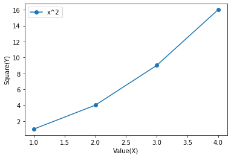

# 1. Write a Python program to create pie chart of Houe construction cost Plumbing 12%, Bricks 10%, Cement 20%, Steel 25%)


```python

from matplotlib import pyplot as plt

languages = ['Java', 'Python', 'PHP', 'JavaScript', 'C#', 'C++']
popularity = [22.2, 17.6, 8.8, 8, 7.7, 6.7]

plt.bar(languages, popularity,width=0.5, color=['red', 'blue', 'green', 'yellow', 'orange', 'purple'])

plt.xlabel('Programming Languages')
plt.ylabel('Popularity')

plt.show()

```


    

    


# 2 Write a python program to draw a line graph X = [1,2,3,4] and Y = x^2 mention label as "Value(X)" and "Square(Y)".


```python
# Write a python program to draw a line graph X = [1,2,3,4] and Y = x^2 mention label as "Value(X)" and "Square(Y)".

from matplotlib import pyplot as plt

x = [1, 2, 3, 4]
y = [x ** 2 for x in x]

plt.plot(x, y, marker='o', label='x^2')
plt.xlabel('Value(X)')
plt.ylabel('Square(Y)')

plt.legend()

plt.show()

```


    

    


# Write a Python programming to display a bar chart of the popularity of programming
# Languages.
# Sample data:
# Programming languages: Java, Python, PHP, JavaScript, C#, C++
# Popularity: 22.2, 17.6, 8.8, 8, 7.7, 6.7


```python

from matplotlib import pyplot as plt

languages = ['Java', 'Python', 'PHP', 'JavaScript', 'C#', 'C++']
popularity = [22.2, 17.6, 8.8, 8, 7.7, 6.7]

plt.bar(languages, popularity,width=0.5, color=['red', 'blue', 'green', 'yellow', 'orange', 'purple'])

plt.xlabel('Programming Languages')
plt.ylabel('Popularity')

plt.show()

```

# Draw this graph and apply following operation
###### 1. Print total number of nodes.
###### 2. Print total number of edges.
###### 3. Print list of all the nodes.
###### 4. Print list of all the edges.
###### 5. Print in-degree for all the nodes.
###### 6. Print out-degree for all the nodes.
###### 7. Print successor of node 2.
###### 8. Print predecessor of node 2.


```python

import matplotlib.pyplot as plt
import networkx as nx

G = nx.DiGraph()  # Create a directed graph
G.add_nodes_from([1, 2, 3, 4, 5, 6, 7, 8])
G.add_edges_from([(1, 2), (1, 4), (2, 3), (3, 4), (4, 8), (5, 1), (5, 7), (6, 5), (8, 3)])

nx.draw(G, with_labels=True)
plt.show()
print("Total number of nodes:", G.number_of_nodes())
print("Total number of edges:", G.number_of_edges())
print("List of all the nodes:", list(G.nodes))
print("List of all the edges:", list(G.edges))
print("In-degree for all the nodes:", G.in_degree())
print("Out-degree for all the nodes:", G.out_degree())
print("Successor of node 2:", list(G.successors(2)))
print("Predecessor of node 2:", list(G.predecessors(2)))

```


    

    


    Total number of nodes: 8
    Total number of edges: 9
    List of all the nodes: [1, 2, 3, 4, 5, 6, 7, 8]
    List of all the edges: [(1, 2), (1, 4), (2, 3), (3, 4), (4, 8), (5, 1), (5, 7), (6, 5), (8, 3)]
    In-degree for all the nodes: [(1, 1), (2, 1), (3, 2), (4, 2), (5, 1), (6, 0), (7, 1), (8, 1)]
    Out-degree for all the nodes: [(1, 2), (2, 1), (3, 1), (4, 1), (5, 2), (6, 1), (7, 0), (8, 1)]
    Successor of node 2: [3]
    Predecessor of node 2: [1]
    


```python

```
