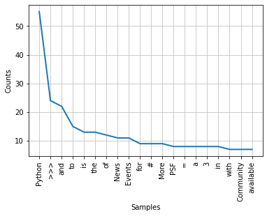

# 1. Write a Pandas program to read a CSV file from a specified source and print the first 10 rows.


```python
import pandas as pd

data = pd.read_csv("diamonds.csv")
print(data.head(10))
```

       carat        cut color clarity  depth  table  price     x     y     z
    0   0.23      Ideal     E     SI2   61.5   55.0    326  3.95  3.98  2.43
    1   0.21    Premium     E     SI1   59.8   61.0    326  3.89  3.84  2.31
    2   0.23       Good     E     VS1   56.9   65.0    327  4.05  4.07  2.31
    3   0.29    Premium     I     VS2   62.4   58.0    334  4.20  4.23  2.63
    4   0.31       Good     J     SI2   63.3   58.0    335  4.34  4.35  2.75
    5   0.24  Very Good     J    VVS2   62.8   57.0    336  3.94  3.96  2.48
    6   0.24  Very Good     I    VVS1   62.3   57.0    336  3.95  3.98  2.47
    7   0.26  Very Good     H     SI1   61.9   55.0    337  4.07  4.11  2.53
    8   0.22       Fair     E     VS2   65.1   61.0    337  3.87  3.78  2.49
    9   0.23  Very Good     H     VS1   59.4   61.0    338  4.00  4.05  2.39
    

#  2. Write a Pandas program to read a dataset from diamonds Data Frame and print the last 6 rows. 


```python
import pandas as pd

data = pd.read_csv("diamonds.csv")
print(data.tail(6))
```

           carat        cut color clarity  depth  table  price     x     y     z
    53934   0.72    Premium     D     SI1   62.7   59.0   2757  5.69  5.73  3.58
    53935   0.72      Ideal     D     SI1   60.8   57.0   2757  5.75  5.76  3.50
    53936   0.72       Good     D     SI1   63.1   55.0   2757  5.69  5.75  3.61
    53937   0.70  Very Good     D     SI1   62.8   60.0   2757  5.66  5.68  3.56
    53938   0.86    Premium     H     SI2   61.0   58.0   2757  6.15  6.12  3.74
    53939   0.75      Ideal     D     SI2   62.2   55.0   2757  5.83  5.87  3.64
    

# 3. Write a Pandas program to select a series from diamonds Data Frame. Print the content of the series


```python
import pandas as pd

data = pd.read_csv("diamonds.csv")
print(data['price'])
```

    0         326
    1         326
    2         327
    3         334
    4         335
             ... 
    53935    2757
    53936    2757
    53937    2757
    53938    2757
    53939    2757
    Name: price, Length: 53940, dtype: int64
    

# 4. Write a Pandas program to find the number of rows and columns and the data type of each column of the diamonds Data frame. 


```python
import pandas as pd

data = pd.read_csv("diamonds.csv")
print(data.shape)
print(data.dtypes)
```

    (53940, 10)
    carat      float64
    cut         object
    color       object
    clarity     object
    depth      float64
    table      float64
    price        int64
    x          float64
    y          float64
    z          float64
    dtype: object
    

# 5. Write a Pandas program to rename two of the columns of the diamonds Data frame. 


```python
import pandas as pd

data = pd.read_csv("diamonds.csv")
print(data.head(4))
data.rename(columns={'color': 'diamond_color', 'clarity': 'dimaond_clarity'}, inplace=True)
print(data.head(4))
```

       carat      cut color clarity  depth  table  price     x     y     z
    0   0.23    Ideal     E     SI2   61.5   55.0    326  3.95  3.98  2.43
    1   0.21  Premium     E     SI1   59.8   61.0    326  3.89  3.84  2.31
    2   0.23     Good     E     VS1   56.9   65.0    327  4.05  4.07  2.31
    3   0.29  Premium     I     VS2   62.4   58.0    334  4.20  4.23  2.63
       carat      cut diamond_color dimaond_clarity  depth  table  price     x  \
    0   0.23    Ideal             E             SI2   61.5   55.0    326  3.95   
    1   0.21  Premium             E             SI1   59.8   61.0    326  3.89   
    2   0.23     Good             E             VS1   56.9   65.0    327  4.05   
    3   0.29  Premium             I             VS2   62.4   58.0    334  4.20   
    
          y     z  
    0  3.98  2.43  
    1  3.84  2.31  
    2  4.07  2.31  
    3  4.23  2.63  
    

# 6. Write a Pandas program to Sort the diamonds data based on length ascending and descending both


```python
import pandas as pd

data = pd.read_csv("diamonds.csv")
print(data.head(3))
ascending = data.sort_values(by='x', ascending=True)
print(ascending.head(3))
decending = data.sort_values(by='x', ascending=False)
print(decending.head(3))
```

       carat      cut color clarity  depth  table  price     x     y     z
    0   0.23    Ideal     E     SI2   61.5   55.0    326  3.95  3.98  2.43
    1   0.21  Premium     E     SI1   59.8   61.0    326  3.89  3.84  2.31
    2   0.23     Good     E     VS1   56.9   65.0    327  4.05  4.07  2.31
           carat      cut color clarity  depth  table  price    x    y    z
    49556   0.71     Good     F     SI2   64.1   60.0   2130  0.0  0.0  0.0
    26243   1.20  Premium     D    VVS1   62.1   59.0  15686  0.0  0.0  0.0
    27429   2.25  Premium     H     SI2   62.8   59.0  18034  0.0  0.0  0.0
           carat      cut color clarity  depth  table  price      x      y     z
    27415   5.01     Fair     J      I1   65.5   59.0  18018  10.74  10.54  6.98
    27630   4.50     Fair     J      I1   65.8   58.0  18531  10.23  10.16  6.72
    25998   4.01  Premium     I      I1   61.0   61.0  15223  10.14  10.10  6.17
    

# 7. Write a Pandas program to remove the second column of the diamonds Data frame. 


```python
import pandas as pd

data = pd.read_csv("diamonds.csv")
print(data.head())
data.drop('cut', axis=1, inplace=True)
print(data.head())
```

       carat      cut color clarity  depth  table  price     x     y     z
    0   0.23    Ideal     E     SI2   61.5   55.0    326  3.95  3.98  2.43
    1   0.21  Premium     E     SI1   59.8   61.0    326  3.89  3.84  2.31
    2   0.23     Good     E     VS1   56.9   65.0    327  4.05  4.07  2.31
    3   0.29  Premium     I     VS2   62.4   58.0    334  4.20  4.23  2.63
    4   0.31     Good     J     SI2   63.3   58.0    335  4.34  4.35  2.75
       carat color clarity  depth  table  price     x     y     z
    0   0.23     E     SI2   61.5   55.0    326  3.95  3.98  2.43
    1   0.21     E     SI1   59.8   61.0    326  3.89  3.84  2.31
    2   0.23     E     VS1   56.9   65.0    327  4.05  4.07  2.31
    3   0.29     I     VS2   62.4   58.0    334  4.20  4.23  2.63
    4   0.31     J     SI2   63.3   58.0    335  4.34  4.35  2.75
    

# 8. Write a Pandas program to find the details of the diamonds where depth>61, price>340, and cut=’Good’.


```python
import pandas as pd

data = pd.read_csv("diamonds.csv")

# Original data frame
print("Original data frame:")
print(data.head(3))

# Updated data frame
print("Updated data frame:")
data = data[(data.depth > 61) & (data.price > 340) & (data.cut == 'Good')]
print(data.head(3))
```

    Original data frame:
       carat      cut color clarity  depth  table  price     x     y     z
    0   0.23    Ideal     E     SI2   61.5   55.0    326  3.95  3.98  2.43
    1   0.21  Premium     E     SI1   59.8   61.0    326  3.89  3.84  2.31
    2   0.23     Good     E     VS1   56.9   65.0    327  4.05  4.07  2.31
    Updated data frame:
        carat   cut color clarity  depth  table  price     x     y     z
    17    0.3  Good     J     SI1   63.4    NaN    351  4.23  4.29  2.70
    18    0.3  Good     J     SI1   63.8   56.0    351  4.23  4.26  2.71
    20    0.3  Good     I     SI2   63.3   56.0    351  4.26  4.30  2.71
    

# 9.Write a Pandas program to calculate the count, the minimum, and maximum price for each cut of diamonds Data Frame. 


```python
import pandas as pd

data = pd.read_csv("diamonds.csv")

print("Original Dataframe:")
print(data.head(3))
print("\nCount, minimum, maximum  price for each cut of diamonds DataFrame:")
print(data.groupby('cut').price.agg(['count', 'min', 'max']))
```

    Original Dataframe:
       carat      cut color clarity  depth  table  price     x     y     z
    0   0.23    Ideal     E     SI2   61.5   55.0    326  3.95  3.98  2.43
    1   0.21  Premium     E     SI1   59.8   61.0    326  3.89  3.84  2.31
    2   0.23     Good     E     VS1   56.9   65.0    327  4.05  4.07  2.31
    
    Count, minimum, maximum  price for each cut of diamonds DataFrame:
               count  min    max
    cut                         
    Fair        1610  337  18574
    Good        4906  327  18788
    Ideal      21551  326  18806
    Premium    13791  326  18823
    Very Good  12082  336  18818
    

# 10. Write Pandas program to Demonstrate handling of Missing values (Remove column, Remove rows and Filling values Etc.)


```python
import pandas as pd

data = pd.read_csv("diamonds.csv")

# Describe Basic Information
print(data.info())
print(data.isnull().sum())
print(data.describe())

# print Null values row
print(data[data['table'].isna()])

# Remove rows or column
updated_data=data.dropna(axis=1)
print(updated_data)
print(updated_data.info())

# Fill missing values
updated_data = data
print(updated_data.info())

updated_data['table']=updated_data['table'].fillna(updated_data['table'].mean())
# Display after update
print(updated_data.info())
print(updated_data[7:87])
print(updated_data[updated_data['table'].isna()])
```

    <class 'pandas.core.frame.DataFrame'>
    RangeIndex: 53940 entries, 0 to 53939
    Data columns (total 10 columns):
     #   Column   Non-Null Count  Dtype  
    ---  ------   --------------  -----  
     0   carat    53940 non-null  float64
     1   cut      53940 non-null  object 
     2   color    53940 non-null  object 
     3   clarity  53940 non-null  object 
     4   depth    53940 non-null  float64
     5   table    53939 non-null  float64
     6   price    53940 non-null  int64  
     7   x        53940 non-null  float64
     8   y        53940 non-null  float64
     9   z        53940 non-null  float64
    dtypes: float64(6), int64(1), object(3)
    memory usage: 4.1+ MB
    None
    carat      0
    cut        0
    color      0
    clarity    0
    depth      0
    table      1
    price      0
    x          0
    y          0
    z          0
    dtype: int64
                  carat         depth         table         price             x  \
    count  53940.000000  53940.000000  53939.000000  53940.000000  53940.000000   
    mean       0.797940     61.749405     57.457248   3932.799722      5.731157   
    std        0.474011      1.432621      2.234462   3989.439738      1.121761   
    min        0.200000     43.000000     43.000000    326.000000      0.000000   
    25%        0.400000     61.000000     56.000000    950.000000      4.710000   
    50%        0.700000     61.800000     57.000000   2401.000000      5.700000   
    75%        1.040000     62.500000     59.000000   5324.250000      6.540000   
    max        5.010000     79.000000     95.000000  18823.000000     10.740000   
    
                      y             z  
    count  53940.000000  53940.000000  
    mean       5.734526      3.538734  
    std        1.142135      0.705699  
    min        0.000000      0.000000  
    25%        4.720000      2.910000  
    50%        5.710000      3.530000  
    75%        6.540000      4.040000  
    max       58.900000     31.800000  
        carat   cut color clarity  depth  table  price     x     y    z
    17    0.3  Good     J     SI1   63.4    NaN    351  4.23  4.29  2.7
           carat        cut color clarity  depth  price     x     y     z
    0       0.23      Ideal     E     SI2   61.5    326  3.95  3.98  2.43
    1       0.21    Premium     E     SI1   59.8    326  3.89  3.84  2.31
    2       0.23       Good     E     VS1   56.9    327  4.05  4.07  2.31
    3       0.29    Premium     I     VS2   62.4    334  4.20  4.23  2.63
    4       0.31       Good     J     SI2   63.3    335  4.34  4.35  2.75
    ...      ...        ...   ...     ...    ...    ...   ...   ...   ...
    53935   0.72      Ideal     D     SI1   60.8   2757  5.75  5.76  3.50
    53936   0.72       Good     D     SI1   63.1   2757  5.69  5.75  3.61
    53937   0.70  Very Good     D     SI1   62.8   2757  5.66  5.68  3.56
    53938   0.86    Premium     H     SI2   61.0   2757  6.15  6.12  3.74
    53939   0.75      Ideal     D     SI2   62.2   2757  5.83  5.87  3.64
    
    [53940 rows x 9 columns]
    <class 'pandas.core.frame.DataFrame'>
    RangeIndex: 53940 entries, 0 to 53939
    Data columns (total 9 columns):
     #   Column   Non-Null Count  Dtype  
    ---  ------   --------------  -----  
     0   carat    53940 non-null  float64
     1   cut      53940 non-null  object 
     2   color    53940 non-null  object 
     3   clarity  53940 non-null  object 
     4   depth    53940 non-null  float64
     5   price    53940 non-null  int64  
     6   x        53940 non-null  float64
     7   y        53940 non-null  float64
     8   z        53940 non-null  float64
    dtypes: float64(5), int64(1), object(3)
    memory usage: 3.7+ MB
    None
    <class 'pandas.core.frame.DataFrame'>
    RangeIndex: 53940 entries, 0 to 53939
    Data columns (total 10 columns):
     #   Column   Non-Null Count  Dtype  
    ---  ------   --------------  -----  
     0   carat    53940 non-null  float64
     1   cut      53940 non-null  object 
     2   color    53940 non-null  object 
     3   clarity  53940 non-null  object 
     4   depth    53940 non-null  float64
     5   table    53939 non-null  float64
     6   price    53940 non-null  int64  
     7   x        53940 non-null  float64
     8   y        53940 non-null  float64
     9   z        53940 non-null  float64
    dtypes: float64(6), int64(1), object(3)
    memory usage: 4.1+ MB
    None
    <class 'pandas.core.frame.DataFrame'>
    RangeIndex: 53940 entries, 0 to 53939
    Data columns (total 10 columns):
     #   Column   Non-Null Count  Dtype  
    ---  ------   --------------  -----  
     0   carat    53940 non-null  float64
     1   cut      53940 non-null  object 
     2   color    53940 non-null  object 
     3   clarity  53940 non-null  object 
     4   depth    53940 non-null  float64
     5   table    53940 non-null  float64
     6   price    53940 non-null  int64  
     7   x        53940 non-null  float64
     8   y        53940 non-null  float64
     9   z        53940 non-null  float64
    dtypes: float64(6), int64(1), object(3)
    memory usage: 4.1+ MB
    None
        carat        cut color clarity  depth  table  price     x     y     z
    7    0.26  Very Good     H     SI1   61.9   55.0    337  4.07  4.11  2.53
    8    0.22       Fair     E     VS2   65.1   61.0    337  3.87  3.78  2.49
    9    0.23  Very Good     H     VS1   59.4   61.0    338  4.00  4.05  2.39
    10   0.30       Good     J     SI1   64.0   55.0    339  4.25  4.28  2.73
    11   0.23      Ideal     J     VS1   62.8   56.0    340  3.93  3.90  2.46
    ..    ...        ...   ...     ...    ...    ...    ...   ...   ...   ...
    82   0.26      Ideal     E    VVS2   62.9   58.0    554  4.02  4.06  2.54
    83   0.38      Ideal     I     SI2   61.6   56.0    554  4.65  4.67  2.87
    84   0.26       Good     E    VVS1   57.9   60.0    554  4.22  4.25  2.45
    85   0.24    Premium     G    VVS1   62.3   59.0    554  3.95  3.92  2.45
    86   0.24    Premium     H    VVS1   61.2   58.0    554  4.01  3.96  2.44
    
    [80 rows x 10 columns]
    Empty DataFrame
    Columns: [carat, cut, color, clarity, depth, table, price, x, y, z]
    Index: []
    

# 11. Write a program using pandas to display content of XML file. (Create any XML file of your choice) 


```python
import xml.etree.ElementTree as et

import pandas as pd

xtree = et.parse("test.xml")
xroot = xtree.getroot()

df_cols = ["name", "email", "grade", "age"]
rows = []

for node in xroot:
    s_name = node.attrib.get("name")
    s_mail = node.find("email").text if node is not None else None
    s_grade = node.find("grade").text if node is not None else None
    s_age = node.find("age").text if node is not None else None

    rows.append({"name": s_name, "email": s_mail,
                 "grade": s_grade, "age": s_age})

out_df = pd.DataFrame(rows, columns=df_cols)
print(out_df)

```

        name                    email grade age
    0  hiren  hiren14lalani@gmail.com     A  20
    1  Rajvi      rajvi@wordpress.com     B  16
    2    vur       vur@contact.hr.com     C  20
    3    tur   tur@contact.realtk.com     A  20
    

# 12. Write a program to demonstrate the Groupby, Join and Merge. 


```python
import pandas as pd

a = pd.DataFrame({'column1': ['A', 'C', 'D', 'E'],
                  'column2': ['F', 'G', 'H', 'I'],
                  'column3': ['J', 'K', 'L', 'M'],
                  'column4': ['N', 'O', 'P', 'Q']},
                 index=[1, 2, 3, 4])
b = pd.DataFrame({'column3': ['R', 'S', 'T', 'U'],
                  'column5': ['V', 'W', 'X', 'Y'],
                  'column6': ['Z', 'α', 'β', 'υ'],
                  'column7': ['σ', 'χ', 'ι', 'κ']},
                 index=[3, 4, 5, 6])
result = pd.concat([a, b], axis=0, join='outer')  # outer join with axis 0
print(result)
result = pd.concat([a, b], axis=1, join='outer')  # outer join with  axis=1
print(result)
result = pd.concat([a, b], axis=0, join='inner')  # inner join with axis 0
print(result)
result = pd.concat([a, b], axis=1, join='inner')  # inner join with  axis=1
print(result)

# Demonstrate Merge
c = pd.DataFrame({'key': ['A', 'C', 'D', 'E'],
                  'column2': ['F', 'G', 'H', 'I'],
                  'column3': ['J', 'K', 'L', 'M'],
                  'column4': ['N', 'O', 'P', 'Q']},
                 index=[1, 2, 3, 4])
d = pd.DataFrame({'key': ['C', 'D', 'T', 'U'],
                  'column5': ['V', 'W', 'X', 'Y'],
                  'column6': ['Z', 'α', 'β', 'υ'],
                  'column7': ['σ', 'χ', 'ι', 'κ']},
                 index=[3, 4, 5, 6])
result = pd.merge(c, d, on='key')
print(result)

# Demonstrate Groupby

e = pd.DataFrame({"key": ["a", "b", "c", "a", "b", "c"], "values": [1, 2, 3, 1, 2, 3]})
f = e.groupby("key").sum()
print(f)
```

      column1 column2 column3 column4 column5 column6 column7
    1       A       F       J       N     NaN     NaN     NaN
    2       C       G       K       O     NaN     NaN     NaN
    3       D       H       L       P     NaN     NaN     NaN
    4       E       I       M       Q     NaN     NaN     NaN
    3     NaN     NaN       R     NaN       V       Z       σ
    4     NaN     NaN       S     NaN       W       α       χ
    5     NaN     NaN       T     NaN       X       β       ι
    6     NaN     NaN       U     NaN       Y       υ       κ
      column1 column2 column3 column4 column3 column5 column6 column7
    1       A       F       J       N     NaN     NaN     NaN     NaN
    2       C       G       K       O     NaN     NaN     NaN     NaN
    3       D       H       L       P       R       V       Z       σ
    4       E       I       M       Q       S       W       α       χ
    5     NaN     NaN     NaN     NaN       T       X       β       ι
    6     NaN     NaN     NaN     NaN       U       Y       υ       κ
      column3
    1       J
    2       K
    3       L
    4       M
    3       R
    4       S
    5       T
    6       U
      column1 column2 column3 column4 column3 column5 column6 column7
    3       D       H       L       P       R       V       Z       σ
    4       E       I       M       Q       S       W       α       χ
      key column2 column3 column4 column5 column6 column7
    0   C       G       K       O       V       Z       σ
    1   D       H       L       P       W       α       χ
         values
    key        
    a         2
    b         4
    c         6
    

# 13. Write a program to create Class Student and demonstrate the magic Function. 


```python
class student():
    def __init__(self, *args):
        print("Now called __init__ magic method, after tha initialised parameters")
        self.name = args[0]
        self.subject = args[1]
        self.marks = args[2]

    def called(self):
        print(self.name)


Student = student("hiren", "Python", 100)

print("Details are: \n", Student.name, "\n", Student.subject, "\n", Student.marks)
Student.called()


# _add_method adding two object

# Creating a class
class Method_1:
    def __init__(self, *argument):
        self.attribute = argument[0]
        self.attribute2 = argument[1]


# Creating a second class
class Method_2:
    def __init__(self, argument):
        self.attribute = argument
    # creating the instances


instance_1 = Method_1(" Arg", "Welcome")
print(instance_1.attribute)
instance_2 = Method_2("1")
print(instance_2.attribute)

# Adding two attributes of the instances
print(instance_2.attribute + instance_1.attribute)

```

    Now called __init__ magic method, after tha initialised parameters
    Details are: 
     hiren 
     Python 
     100
    hiren
     Arg
    1
    1 Arg
    

# 14. Write a program to demonstrate Bag of word model. 


```python
! pip install nltk
```

    Requirement already satisfied: nltk in c:\users\hiren\anaconda3\lib\site-packages (3.7)
    Requirement already satisfied: click in c:\users\hiren\anaconda3\lib\site-packages (from nltk) (8.0.4)
    Requirement already satisfied: regex>=2021.8.3 in c:\users\hiren\anaconda3\lib\site-packages (from nltk) (2022.3.15)
    Requirement already satisfied: tqdm in c:\users\hiren\anaconda3\lib\site-packages (from nltk) (4.64.0)
    Requirement already satisfied: joblib in c:\users\hiren\anaconda3\lib\site-packages (from nltk) (1.1.0)
    Requirement already satisfied: colorama in c:\users\hiren\anaconda3\lib\site-packages (from click->nltk) (0.4.4)
    


```python
import re

import nltk

# Need to install nltk using pip

# execute the text here as :
text = "Hello Everyone Hello again"

# Remove below line comment when run first time
# nltk.download('punkt')
dataset = nltk.sent_tokenize(text)
for i in range(len(dataset)):
    dataset[i] = dataset[i].lower()
    dataset[i] = re.sub(r'\W', ' ', dataset[i])
    dataset[i] = re.sub(r'\s+', ' ', dataset[i])
# Creating the Bag of Words model
word2count = {}
for data in dataset:
    words = nltk.word_tokenize(data)
    for word in words:
        if word not in word2count.keys():
            word2count[word] = 1
        else:
            word2count[word] += 1

print(word2count)
```

    {'hello': 2, 'everyone': 1, 'again': 1}
    

# TF-IDF, NLP Programming 

# 1. Write a Regular expression code to verify the email address. 


```python
import re

email = input("Enter your email address: ")
if re.match(r"^[a-zA-Z\d_.+-]+@[a-zA-Z\d]+\.[a-zA-Z\d.]+$", email):
    print("Valid email address")
else:
    print("Invalid email address")
```

    Enter your email address: hiren14lalani@gmail.com
    Valid email address
    

# 2 Write a program to read an HTML file using the beautiful soup library and parse the
## following information.
### a. To read all the hyperlinks
### b. To real head part
### c. To real table data
### d. After reading all the information shown in a proper format 


```python
import requests
from bs4 import BeautifulSoup

html = requests.get("http://www.python.org").text
soup = BeautifulSoup(html, 'html.parser')
links = soup.find_all('a')
head = soup.find_all('head')
table = soup.find_all('table')
for i in links:
    print(i.get('href'))
for i in head:
    print(i)
for i in table:
    print(i)

```

    #content
    #python-network
    /
    /psf-landing/
    https://docs.python.org
    https://pypi.org/
    /jobs/
    /community-landing/
    #top
    /
    https://psfmember.org/civicrm/contribute/transact?reset=1&id=2
    #site-map
    #
    javascript:;
    javascript:;
    javascript:;
    #
    https://www.facebook.com/pythonlang?fref=ts
    https://twitter.com/ThePSF
    /community/irc/
    /about/
    /about/apps/
    /about/quotes/
    /about/gettingstarted/
    /about/help/
    http://brochure.getpython.info/
    /downloads/
    /downloads/
    /downloads/source/
    /downloads/windows/
    /downloads/macos/
    /download/other/
    https://docs.python.org/3/license.html
    /download/alternatives
    /doc/
    /doc/
    /doc/av
    https://wiki.python.org/moin/BeginnersGuide
    https://devguide.python.org/
    https://docs.python.org/faq/
    http://wiki.python.org/moin/Languages
    http://python.org/dev/peps/
    https://wiki.python.org/moin/PythonBooks
    /doc/essays/
    /community/
    /community/diversity/
    /community/lists/
    /community/irc/
    /community/forums/
    /psf/annual-report/2021/
    /community/workshops/
    /community/sigs/
    /community/logos/
    https://wiki.python.org/moin/
    /community/merchandise/
    /community/awards
    /psf/conduct/
    /psf/get-involved/
    /psf/community-stories/
    /success-stories/
    /success-stories/category/arts/
    /success-stories/category/business/
    /success-stories/category/education/
    /success-stories/category/engineering/
    /success-stories/category/government/
    /success-stories/category/scientific/
    /success-stories/category/software-development/
    /blogs/
    /blogs/
    /psf/newsletter/
    http://planetpython.org/
    http://pyfound.blogspot.com/
    http://pycon.blogspot.com/
    /events/
    /events/python-events/
    /events/python-user-group/
    /events/python-events/past/
    /events/python-user-group/past/
    https://wiki.python.org/moin/PythonEventsCalendar#Submitting_an_Event
    /shell/
    //docs.python.org/3/tutorial/controlflow.html#defining-functions
    //docs.python.org/3/tutorial/introduction.html#lists
    http://docs.python.org/3/tutorial/introduction.html#using-python-as-a-calculator
    //docs.python.org/3/tutorial/
    //docs.python.org/3/tutorial/controlflow.html
    /doc/
    /about/gettingstarted/
    /downloads/release/python-3107/
    https://docs.python.org
    //jobs.python.org
    https://blog.python.org
    https://pythoninsider.blogspot.com/2022/09/python-3110rc2-is-now-available.html
    https://pythoninsider.blogspot.com/2022/09/python-releases-3107-3914-3814-and-3714.html
    https://pythoninsider.blogspot.com/2022/08/python-3110rc1-is-now-available.html
    https://pythoninsider.blogspot.com/2022/08/python-3106-is-available.html
    https://pythoninsider.blogspot.com/2022/07/python-3110b5-is-now-available.html
    /events/calendars/
    /events/python-user-group/1334/
    /events/python-user-group/1333/
    /events/python-events/1332/
    /events/python-user-group/1323/
    /events/python-events/1274/
    /success-stories/
    /success-stories/abridging-clinical-conversations-using-python/
    /success-stories/abridging-clinical-conversations-using-python/
    /about/apps
    http://www.djangoproject.com/
    http://www.pylonsproject.org/
    http://bottlepy.org
    http://tornadoweb.org
    http://flask.pocoo.org/
    http://www.web2py.com/
    http://wiki.python.org/moin/TkInter
    https://wiki.gnome.org/Projects/PyGObject
    http://www.riverbankcomputing.co.uk/software/pyqt/intro
    https://wiki.qt.io/PySide
    https://kivy.org/
    http://www.wxpython.org/
    http://www.scipy.org
    http://pandas.pydata.org/
    http://ipython.org
    http://buildbot.net/
    http://trac.edgewall.org/
    http://roundup.sourceforge.net/
    http://www.ansible.com
    https://saltproject.io
    https://www.openstack.org
    https://xon.sh
    /dev/peps/
    /dev/peps/peps.rss
    /psf/
    /psf/
    /users/membership/
    /psf/donations/
    #python-network
    /about/
    /about/apps/
    /about/quotes/
    /about/gettingstarted/
    /about/help/
    http://brochure.getpython.info/
    /downloads/
    /downloads/
    /downloads/source/
    /downloads/windows/
    /downloads/macos/
    /download/other/
    https://docs.python.org/3/license.html
    /download/alternatives
    /doc/
    /doc/
    /doc/av
    https://wiki.python.org/moin/BeginnersGuide
    https://devguide.python.org/
    https://docs.python.org/faq/
    http://wiki.python.org/moin/Languages
    http://python.org/dev/peps/
    https://wiki.python.org/moin/PythonBooks
    /doc/essays/
    /community/
    /community/diversity/
    /community/lists/
    /community/irc/
    /community/forums/
    /psf/annual-report/2021/
    /community/workshops/
    /community/sigs/
    /community/logos/
    https://wiki.python.org/moin/
    /community/merchandise/
    /community/awards
    /psf/conduct/
    /psf/get-involved/
    /psf/community-stories/
    /success-stories/
    /success-stories/category/arts/
    /success-stories/category/business/
    /success-stories/category/education/
    /success-stories/category/engineering/
    /success-stories/category/government/
    /success-stories/category/scientific/
    /success-stories/category/software-development/
    /blogs/
    /blogs/
    /psf/newsletter/
    http://planetpython.org/
    http://pyfound.blogspot.com/
    http://pycon.blogspot.com/
    /events/
    /events/python-events/
    /events/python-user-group/
    /events/python-events/past/
    /events/python-user-group/past/
    https://wiki.python.org/moin/PythonEventsCalendar#Submitting_an_Event
    /dev/
    https://devguide.python.org/
    https://bugs.python.org/
    https://mail.python.org/mailman/listinfo/python-dev
    /dev/core-mentorship/
    /dev/security/
    #python-network
    /about/help/
    /community/diversity/
    https://github.com/python/pythondotorg/issues
    https://status.python.org/
    /psf-landing/
    /about/legal/
    /privacy/
    /psf/sponsorship/sponsors/#heroku
    <head>
    <meta charset="utf-8"/>
    <meta content="IE=edge" http-equiv="X-UA-Compatible"/>
    <link href="//ajax.googleapis.com/ajax/libs/jquery/1.8.2/jquery.min.js" rel="prefetch"/>
    <link href="//ajax.googleapis.com/ajax/libs/jqueryui/1.12.1/jquery-ui.min.js" rel="prefetch"/>
    <meta content="Python.org" name="application-name"/>
    <meta content="The official home of the Python Programming Language" name="msapplication-tooltip"/>
    <meta content="Python.org" name="apple-mobile-web-app-title"/>
    <meta content="yes" name="apple-mobile-web-app-capable"/>
    <meta content="black" name="apple-mobile-web-app-status-bar-style"/>
    <meta content="width=device-width, initial-scale=1.0" name="viewport"/>
    <meta content="True" name="HandheldFriendly"/>
    <meta content="telephone=no" name="format-detection"/>
    <meta content="on" http-equiv="cleartype"/>
    <meta content="false" http-equiv="imagetoolbar"/>
    <script async="" crossorigin="anonymous" integrity="sha256-U3hKDidudIaxBDEzwGJApJgPEf2mWk6cfMWghrAa6i0= sha384-UcmsCqcNRSLW/dV3Lo1oCi2/VaurXbib6p4HyUEOeIa/4OpsrnucrugAefzVZJfI sha512-q4t1L4xEjGV2R4hzqCa41P8jrgFUS8xTb8rdNv4FGvw7FpydVj/kkxBJHOiaoxHa8olCcx1Slk9K+3sNbsM4ug==" src="https://media.ethicalads.io/media/client/v1.4.0/ethicalads.min.js"></script>
    <script src="/static/js/libs/modernizr.js"></script>
    <link href="/static/stylesheets/style.2135bffe4dde.css" media="all" rel="stylesheet" title="default" type="text/css">
    <link href="/static/stylesheets/mq.f9187444a4a1.css" media="not print, braille, embossed, speech, tty" rel="stylesheet" type="text/css">
    <!--[if (lte IE 8)&(!IEMobile)]>
        <link href="/static/stylesheets/no-mq.bf0c425cdb73.css" rel="stylesheet" type="text/css" media="screen" />
        
        
        <![endif]-->
    <link href="//ajax.googleapis.com/ajax/libs/jqueryui/1.12.1/themes/smoothness/jquery-ui.css" rel="stylesheet"/>
    <link href="/static/favicon.ico" rel="icon" type="image/x-icon"/>
    <link href="/static/apple-touch-icon-144x144-precomposed.png" rel="apple-touch-icon-precomposed" sizes="144x144"/>
    <link href="/static/apple-touch-icon-114x114-precomposed.png" rel="apple-touch-icon-precomposed" sizes="114x114"/>
    <link href="/static/apple-touch-icon-72x72-precomposed.png" rel="apple-touch-icon-precomposed" sizes="72x72"/>
    <link href="/static/apple-touch-icon-precomposed.png" rel="apple-touch-icon-precomposed"/>
    <link href="/static/apple-touch-icon-precomposed.png" rel="apple-touch-icon"/>
    <meta content="/static/metro-icon-144x144-precomposed.png" name="msapplication-TileImage"/><!-- white shape -->
    <meta content="#3673a5" name="msapplication-TileColor"/><!-- python blue -->
    <meta content="#3673a5" name="msapplication-navbutton-color"/>
    <title>Welcome to Python.org</title>
    <meta content="The official home of the Python Programming Language" name="description"/>
    <meta content="Python programming language object oriented web free open source software license documentation download community" name="keywords"/>
    <meta content="website" property="og:type"/>
    <meta content="Python.org" property="og:site_name"/>
    <meta content="Welcome to Python.org" property="og:title"/>
    <meta content="The official home of the Python Programming Language" property="og:description"/>
    <meta content="https://www.python.org/static/opengraph-icon-200x200.png" property="og:image"/>
    <meta content="https://www.python.org/static/opengraph-icon-200x200.png" property="og:image:secure_url"/>
    <meta content="https://www.python.org/" property="og:url"/>
    <link href="/static/humans.txt" rel="author"/>
    <link href="https://www.python.org/dev/peps/peps.rss/" rel="alternate" title="Python Enhancement Proposals" type="application/rss+xml"/>
    <link href="https://www.python.org/jobs/feed/rss/" rel="alternate" title="Python Job Opportunities" type="application/rss+xml"/>
    <link href="https://feeds.feedburner.com/PythonSoftwareFoundationNews" rel="alternate" title="Python Software Foundation News" type="application/rss+xml"/>
    <link href="https://feeds.feedburner.com/PythonInsider" rel="alternate" title="Python Insider" type="application/rss+xml"/>
    <script type="application/ld+json">
         {
           "@context": "https://schema.org",
           "@type": "WebSite",
           "url": "https://www.python.org/",
           "potentialAction": {
             "@type": "SearchAction",
             "target": "https://www.python.org/search/?q={search_term_string}",
             "query-input": "required name=search_term_string"
           }
         }
        </script>
    <script type="text/javascript">
        var _gaq = _gaq || [];
        _gaq.push(['_setAccount', 'UA-39055973-1']);
        _gaq.push(['_trackPageview']);
    
        (function() {
            var ga = document.createElement('script'); ga.type = 'text/javascript'; ga.async = true;
            ga.src = ('https:' == document.location.protocol ? 'https://ssl' : 'http://www') + '.google-analytics.com/ga.js';
            var s = document.getElementsByTagName('script')[0]; s.parentNode.insertBefore(ga, s);
        })();
        </script>
    </link></link></head>
    <table border="0" cellpadding="0" cellspacing="0" class="quote-from" width="100%">
    <tbody>
    <tr>
    <td><p><a href="/success-stories/abridging-clinical-conversations-using-python/">Abridging clinical conversations using Python</a> <em>by Nimshi Venkat and Sandeep Konam</em></p></td>
    </tr>
    </tbody>
    </table>
    

# 3  Write NLP program using NLTK library to read text data from website and convert into appropriate feature table using Bag of words method.


```python
import nltk
import pandas as pd
import requests
from bs4 import BeautifulSoup

html = requests.get("http://www.python.org").text
soup = BeautifulSoup(html, 'html.parser')
text = soup.get_text()

# Tokenization
tokens = [t for t in text.split()]
print(tokens)

# Frequency distribution
freq = nltk.FreqDist(tokens)
for key, val in freq.items():
    print(str(key) + ':' + str(val))

# Frequency distribution plot
freq.plot(20, cumulative=False)


# Bag of words
def bag_of_words(words):
    return dict([(word, True) for word in words])


# Get features
words = bag_of_words(tokens)
print(words)

# Data frame
df = pd.DataFrame(words.items(), columns=['words', 'count'])
print(df)
```

    ['Welcome', 'to', 'Python.org', 'Notice:', 'While', 'JavaScript', 'is', 'not', 'essential', 'for', 'this', 'website,', 'your', 'interaction', 'with', 'the', 'content', 'will', 'be', 'limited.', 'Please', 'turn', 'JavaScript', 'on', 'for', 'the', 'full', 'experience.', 'Skip', 'to', 'content', '▼', 'Close', 'Python', 'PSF', 'Docs', 'PyPI', 'Jobs', 'Community', '▲', 'The', 'Python', 'Network', 'Donate', '≡', 'Menu', 'Search', 'This', 'Site', 'GO', 'A', 'A', 'Smaller', 'Larger', 'Reset', 'Socialize', 'Facebook', 'Twitter', 'Chat', 'on', 'IRC', 'About', 'Applications', 'Quotes', 'Getting', 'Started', 'Help', 'Python', 'Brochure', 'Downloads', 'All', 'releases', 'Source', 'code', 'Windows', 'macOS', 'Other', 'Platforms', 'License', 'Alternative', 'Implementations', 'Documentation', 'Docs', 'Audio/Visual', 'Talks', "Beginner's", 'Guide', "Developer's", 'Guide', 'FAQ', 'Non-English', 'Docs', 'PEP', 'Index', 'Python', 'Books', 'Python', 'Essays', 'Community', 'Diversity', 'Mailing', 'Lists', 'IRC', 'Forums', 'PSF', 'Annual', 'Impact', 'Report', 'Python', 'Conferences', 'Special', 'Interest', 'Groups', 'Python', 'Logo', 'Python', 'Wiki', 'Merchandise', 'Community', 'Awards', 'Code', 'of', 'Conduct', 'Get', 'Involved', 'Shared', 'Stories', 'Success', 'Stories', 'Arts', 'Business', 'Education', 'Engineering', 'Government', 'Scientific', 'Software', 'Development', 'News', 'Python', 'News', 'PSF', 'Newsletter', 'Community', 'News', 'PSF', 'News', 'PyCon', 'News', 'Events', 'Python', 'Events', 'User', 'Group', 'Events', 'Python', 'Events', 'Archive', 'User', 'Group', 'Events', 'Archive', 'Submit', 'an', 'Event', '>_', 'Launch', 'Interactive', 'Shell', '#', 'Python', '3:', 'Fibonacci', 'series', 'up', 'to', 'n', '>>>', 'def', 'fib(n):', '>>>', 'a,', 'b', '=', '0,', '1', '>>>', 'while', 'a', '<', 'n:', '>>>', 'print(a,', "end='", "')", '>>>', 'a,', 'b', '=', 'b,', 'a+b', '>>>', 'print()', '>>>', 'fib(1000)', '0', '1', '1', '2', '3', '5', '8', '13', '21', '34', '55', '89', '144', '233', '377', '610', '987', 'Functions', 'Defined', 'The', 'core', 'of', 'extensible', 'programming', 'is', 'defining', 'functions.', 'Python', 'allows', 'mandatory', 'and', 'optional', 'arguments,', 'keyword', 'arguments,', 'and', 'even', 'arbitrary', 'argument', 'lists.', 'More', 'about', 'defining', 'functions', 'in', 'Python', '3', '#', 'Python', '3:', 'List', 'comprehensions', '>>>', 'fruits', '=', "['Banana',", "'Apple',", "'Lime']", '>>>', 'loud_fruits', '=', '[fruit.upper()', 'for', 'fruit', 'in', 'fruits]', '>>>', 'print(loud_fruits)', "['BANANA',", "'APPLE',", "'LIME']", '#', 'List', 'and', 'the', 'enumerate', 'function', '>>>', 'list(enumerate(fruits))', '[(0,', "'Banana'),", '(1,', "'Apple'),", '(2,', "'Lime')]", 'Compound', 'Data', 'Types', 'Lists', '(known', 'as', 'arrays', 'in', 'other', 'languages)', 'are', 'one', 'of', 'the', 'compound', 'data', 'types', 'that', 'Python', 'understands.', 'Lists', 'can', 'be', 'indexed,', 'sliced', 'and', 'manipulated', 'with', 'other', 'built-in', 'functions.', 'More', 'about', 'lists', 'in', 'Python', '3', '#', 'Python', '3:', 'Simple', 'arithmetic', '>>>', '1', '/', '2', '0.5', '>>>', '2', '**', '3', '8', '>>>', '17', '/', '3', '#', 'classic', 'division', 'returns', 'a', 'float', '5.666666666666667', '>>>', '17', '//', '3', '#', 'floor', 'division', '5', 'Intuitive', 'Interpretation', 'Calculations', 'are', 'simple', 'with', 'Python,', 'and', 'expression', 'syntax', 'is', 'straightforward:', 'the', 'operators', '+,', '-,', '*', 'and', '/', 'work', 'as', 'expected;', 'parentheses', '()', 'can', 'be', 'used', 'for', 'grouping.', 'More', 'about', 'simple', 'math', 'functions', 'in', 'Python', '3.', '#', 'Python', '3:', 'Simple', 'output', '(with', 'Unicode)', '>>>', 'print("Hello,', "I'm", 'Python!")', 'Hello,', "I'm", 'Python!', '#', 'Input,', 'assignment', '>>>', 'name', '=', "input('What", 'is', 'your', "name?\\n')", '>>>', "print('Hi,", "%s.'", '%', 'name)', 'What', 'is', 'your', 'name?', 'Python', 'Hi,', 'Python.', 'Quick', '&', 'Easy', 'to', 'Learn', 'Experienced', 'programmers', 'in', 'any', 'other', 'language', 'can', 'pick', 'up', 'Python', 'very', 'quickly,', 'and', 'beginners', 'find', 'the', 'clean', 'syntax', 'and', 'indentation', 'structure', 'easy', 'to', 'learn.', 'Whet', 'your', 'appetite', 'with', 'our', 'Python', '3', 'overview.', '#', 'For', 'loop', 'on', 'a', 'list', '>>>', 'numbers', '=', '[2,', '4,', '6,', '8]', '>>>', 'product', '=', '1', '>>>', 'for', 'number', 'in', 'numbers:', '...', 'product', '=', 'product', '*', 'number', '...', '>>>', "print('The", 'product', "is:',", 'product)', 'The', 'product', 'is:', '384', 'All', 'the', 'Flow', 'You’d', 'Expect', 'Python', 'knows', 'the', 'usual', 'control', 'flow', 'statements', 'that', 'other', 'languages', 'speak', '—', 'if,', 'for,', 'while', 'and', 'range', '—', 'with', 'some', 'of', 'its', 'own', 'twists,', 'of', 'course.', 'More', 'control', 'flow', 'tools', 'in', 'Python', '3', 'Python', 'is', 'a', 'programming', 'language', 'that', 'lets', 'you', 'work', 'quickly', 'and', 'integrate', 'systems', 'more', 'effectively.', 'Learn', 'More', 'Get', 'Started', 'Whether', "you're", 'new', 'to', 'programming', 'or', 'an', 'experienced', 'developer,', "it's", 'easy', 'to', 'learn', 'and', 'use', 'Python.', 'Start', 'with', 'our', 'Beginner’s', 'Guide', 'Download', 'Python', 'source', 'code', 'and', 'installers', 'are', 'available', 'for', 'download', 'for', 'all', 'versions!', 'Latest:', 'Python', '3.10.7', 'Docs', 'Documentation', 'for', "Python's", 'standard', 'library,', 'along', 'with', 'tutorials', 'and', 'guides,', 'are', 'available', 'online.', 'docs.python.org', 'Jobs', 'Looking', 'for', 'work', 'or', 'have', 'a', 'Python', 'related', 'position', 'that', "you're", 'trying', 'to', 'hire', 'for?', 'Our', 'relaunched', 'community-run', 'job', 'board', 'is', 'the', 'place', 'to', 'go.', 'jobs.python.org', 'Latest', 'News', 'More', '2022-09-12', 'Python', '3.11.0rc2', 'is', 'now', 'available', '2022-09-07', 'Python', 'releases', '3.10.7,', '3.9.14,', '3.8.14,', 'and', '3.7.14', 'are', 'now', 'available', '2022-08-08', 'Python', '3.11.0rc1', 'is', 'now', 'available', '2022-08-02', 'Python', '3.10.6', 'is', 'available', '2022-07-26', 'Python', '3.11.0b5', 'is', 'now', 'available', 'Upcoming', 'Events', 'More', '2022-09-26', 'Scikit-learn', 'Sprint', 'Salta', 'AR', '2022', '2022-09-26', 'Jupyter', 'Sprint', '2022-09-26', '9th', 'Conference', 'of', 'Scientific', 'Python', 'Latinamerica', '2022-09-28', 'Python', 'Meeting', 'Düsseldorf', '2022-09-30', 'PyConEs', '-', 'Granada', 'Success', 'Stories', 'More', 'Python', 'powers', 'major', 'aspects', 'of', 'Abridge’s', 'ML', 'lifecycle,', 'including', 'data', 'annotation,', 'research', 'and', 'experimentation,', 'and', 'ML', 'model', 'deployment', 'to', 'production.', 'Abridging', 'clinical', 'conversations', 'using', 'Python', 'by', 'Nimshi', 'Venkat', 'and', 'Sandeep', 'Konam', 'Use', 'Python', 'for…', 'More', 'Web', 'Development:', 'Django,', 'Pyramid,', 'Bottle,', 'Tornado,', 'Flask,', 'web2py', 'GUI', 'Development:', 'tkInter,', 'PyGObject,', 'PyQt,', 'PySide,', 'Kivy,', 'wxPython', 'Scientific', 'and', 'Numeric:', 'SciPy,', 'Pandas,', 'IPython', 'Software', 'Development:', 'Buildbot,', 'Trac,', 'Roundup', 'System', 'Administration:', 'Ansible,', 'Salt,', 'OpenStack,', 'xonsh', '>>>', 'Python', 'Enhancement', 'Proposals', '(PEPs):', 'The', 'future', 'of', 'Python', 'is', 'discussed', 'here.', 'RSS', '>>>', 'Python', 'Software', 'Foundation', 'The', 'mission', 'of', 'the', 'Python', 'Software', 'Foundation', 'is', 'to', 'promote,', 'protect,', 'and', 'advance', 'the', 'Python', 'programming', 'language,', 'and', 'to', 'support', 'and', 'facilitate', 'the', 'growth', 'of', 'a', 'diverse', 'and', 'international', 'community', 'of', 'Python', 'programmers.', 'Learn', 'more', 'Become', 'a', 'Member', 'Donate', 'to', 'the', 'PSF', '▲', 'Back', 'to', 'Top', 'About', 'Applications', 'Quotes', 'Getting', 'Started', 'Help', 'Python', 'Brochure', 'Downloads', 'All', 'releases', 'Source', 'code', 'Windows', 'macOS', 'Other', 'Platforms', 'License', 'Alternative', 'Implementations', 'Documentation', 'Docs', 'Audio/Visual', 'Talks', "Beginner's", 'Guide', "Developer's", 'Guide', 'FAQ', 'Non-English', 'Docs', 'PEP', 'Index', 'Python', 'Books', 'Python', 'Essays', 'Community', 'Diversity', 'Mailing', 'Lists', 'IRC', 'Forums', 'PSF', 'Annual', 'Impact', 'Report', 'Python', 'Conferences', 'Special', 'Interest', 'Groups', 'Python', 'Logo', 'Python', 'Wiki', 'Merchandise', 'Community', 'Awards', 'Code', 'of', 'Conduct', 'Get', 'Involved', 'Shared', 'Stories', 'Success', 'Stories', 'Arts', 'Business', 'Education', 'Engineering', 'Government', 'Scientific', 'Software', 'Development', 'News', 'Python', 'News', 'PSF', 'Newsletter', 'Community', 'News', 'PSF', 'News', 'PyCon', 'News', 'Events', 'Python', 'Events', 'User', 'Group', 'Events', 'Python', 'Events', 'Archive', 'User', 'Group', 'Events', 'Archive', 'Submit', 'an', 'Event', 'Contributing', "Developer's", 'Guide', 'Issue', 'Tracker', 'python-dev', 'list', 'Core', 'Mentorship', 'Report', 'a', 'Security', 'Issue', '▲', 'Back', 'to', 'Top', 'Help', '&', 'General', 'Contact', 'Diversity', 'Initiatives', 'Submit', 'Website', 'Bug', 'Status', 'Copyright', '©2001-2022.', 'Python', 'Software', 'Foundation', 'Legal', 'Statements', 'Privacy', 'Policy', 'Powered', 'by', 'Heroku']
    Welcome:1
    to:15
    Python.org:1
    Notice::1
    While:1
    JavaScript:2
    is:13
    not:1
    essential:1
    for:9
    this:1
    website,:1
    your:4
    interaction:1
    with:7
    the:13
    content:2
    will:1
    be:3
    limited.:1
    Please:1
    turn:1
    on:3
    full:1
    experience.:1
    Skip:1
    ▼:1
    Close:1
    Python:55
    PSF:8
    Docs:6
    PyPI:1
    Jobs:2
    Community:7
    ▲:3
    The:5
    Network:1
    Donate:2
    ≡:1
    Menu:1
    Search:1
    This:1
    Site:1
    GO:1
    A:2
    Smaller:1
    Larger:1
    Reset:1
    Socialize:1
    Facebook:1
    Twitter:1
    Chat:1
    IRC:3
    About:2
    Applications:2
    Quotes:2
    Getting:2
    Started:3
    Help:3
    Brochure:2
    Downloads:2
    All:3
    releases:3
    Source:2
    code:3
    Windows:2
    macOS:2
    Other:2
    Platforms:2
    License:2
    Alternative:2
    Implementations:2
    Documentation:3
    Audio/Visual:2
    Talks:2
    Beginner's:2
    Guide:6
    Developer's:3
    FAQ:2
    Non-English:2
    PEP:2
    Index:2
    Books:2
    Essays:2
    Diversity:3
    Mailing:2
    Lists:4
    Forums:2
    Annual:2
    Impact:2
    Report:3
    Conferences:2
    Special:2
    Interest:2
    Groups:2
    Logo:2
    Wiki:2
    Merchandise:2
    Awards:2
    Code:2
    of:12
    Conduct:2
    Get:3
    Involved:2
    Shared:2
    Stories:5
    Success:3
    Arts:2
    Business:2
    Education:2
    Engineering:2
    Government:2
    Scientific:4
    Software:6
    Development:2
    News:11
    Newsletter:2
    PyCon:2
    Events:11
    User:4
    Group:4
    Archive:4
    Submit:3
    an:3
    Event:2
    >_:1
    Launch:1
    Interactive:1
    Shell:1
    #:9
    3::4
    Fibonacci:1
    series:1
    up:2
    n:1
    >>>:24
    def:1
    fib(n)::1
    a,:2
    b:2
    =:8
    0,:1
    1:5
    while:2
    a:8
    <:1
    n::1
    print(a,:1
    end=':1
    '):1
    b,:1
    a+b:1
    print():1
    fib(1000):1
    0:1
    2:3
    3:8
    5:2
    8:2
    13:1
    21:1
    34:1
    55:1
    89:1
    144:1
    233:1
    377:1
    610:1
    987:1
    Functions:1
    Defined:1
    core:1
    extensible:1
    programming:4
    defining:2
    functions.:2
    allows:1
    mandatory:1
    and:22
    optional:1
    arguments,:2
    keyword:1
    even:1
    arbitrary:1
    argument:1
    lists.:1
    More:9
    about:3
    functions:2
    in:8
    List:2
    comprehensions:1
    fruits:1
    ['Banana',:1
    'Apple',:1
    'Lime']:1
    loud_fruits:1
    [fruit.upper():1
    fruit:1
    fruits]:1
    print(loud_fruits):1
    ['BANANA',:1
    'APPLE',:1
    'LIME']:1
    enumerate:1
    function:1
    list(enumerate(fruits)):1
    [(0,:1
    'Banana'),:1
    (1,:1
    'Apple'),:1
    (2,:1
    'Lime')]:1
    Compound:1
    Data:1
    Types:1
    (known:1
    as:2
    arrays:1
    other:4
    languages):1
    are:5
    one:1
    compound:1
    data:2
    types:1
    that:4
    understands.:1
    can:3
    indexed,:1
    sliced:1
    manipulated:1
    built-in:1
    lists:1
    Simple:2
    arithmetic:1
    /:3
    0.5:1
    **:1
    17:2
    classic:1
    division:2
    returns:1
    float:1
    5.666666666666667:1
    //:1
    floor:1
    Intuitive:1
    Interpretation:1
    Calculations:1
    simple:2
    Python,:1
    expression:1
    syntax:2
    straightforward::1
    operators:1
    +,:1
    -,:1
    *:2
    work:3
    expected;:1
    parentheses:1
    ():1
    used:1
    grouping.:1
    math:1
    3.:1
    output:1
    (with:1
    Unicode):1
    print("Hello,:1
    I'm:2
    Python!"):1
    Hello,:1
    Python!:1
    Input,:1
    assignment:1
    name:1
    input('What:1
    name?\n'):1
    print('Hi,:1
    %s.':1
    %:1
    name):1
    What:1
    name?:1
    Hi,:1
    Python.:2
    Quick:1
    &:2
    Easy:1
    Learn:3
    Experienced:1
    programmers:1
    any:1
    language:2
    pick:1
    very:1
    quickly,:1
    beginners:1
    find:1
    clean:1
    indentation:1
    structure:1
    easy:2
    learn.:1
    Whet:1
    appetite:1
    our:2
    overview.:1
    For:1
    loop:1
    list:2
    numbers:1
    [2,:1
    4,:1
    6,:1
    8]:1
    product:5
    number:2
    numbers::1
    ...:2
    print('The:1
    is:',:1
    product):1
    is::1
    384:1
    Flow:1
    You’d:1
    Expect:1
    knows:1
    usual:1
    control:2
    flow:2
    statements:1
    languages:1
    speak:1
    —:2
    if,:1
    for,:1
    range:1
    some:1
    its:1
    own:1
    twists,:1
    course.:1
    tools:1
    lets:1
    you:1
    quickly:1
    integrate:1
    systems:1
    more:2
    effectively.:1
    Whether:1
    you're:2
    new:1
    or:2
    experienced:1
    developer,:1
    it's:1
    learn:1
    use:1
    Start:1
    Beginner’s:1
    Download:1
    source:1
    installers:1
    available:7
    download:1
    all:1
    versions!:1
    Latest::1
    3.10.7:1
    Python's:1
    standard:1
    library,:1
    along:1
    tutorials:1
    guides,:1
    online.:1
    docs.python.org:1
    Looking:1
    have:1
    related:1
    position:1
    trying:1
    hire:1
    for?:1
    Our:1
    relaunched:1
    community-run:1
    job:1
    board:1
    place:1
    go.:1
    jobs.python.org:1
    Latest:1
    2022-09-12:1
    3.11.0rc2:1
    now:4
    2022-09-07:1
    3.10.7,:1
    3.9.14,:1
    3.8.14,:1
    3.7.14:1
    2022-08-08:1
    3.11.0rc1:1
    2022-08-02:1
    3.10.6:1
    2022-07-26:1
    3.11.0b5:1
    Upcoming:1
    2022-09-26:3
    Scikit-learn:1
    Sprint:2
    Salta:1
    AR:1
    2022:1
    Jupyter:1
    9th:1
    Conference:1
    Latinamerica:1
    2022-09-28:1
    Meeting:1
    Düsseldorf:1
    2022-09-30:1
    PyConEs:1
    -:1
    Granada:1
    powers:1
    major:1
    aspects:1
    Abridge’s:1
    ML:2
    lifecycle,:1
    including:1
    annotation,:1
    research:1
    experimentation,:1
    model:1
    deployment:1
    production.:1
    Abridging:1
    clinical:1
    conversations:1
    using:1
    by:2
    Nimshi:1
    Venkat:1
    Sandeep:1
    Konam:1
    Use:1
    for…:1
    Web:1
    Development::3
    Django,:1
    Pyramid,:1
    Bottle,:1
    Tornado,:1
    Flask,:1
    web2py:1
    GUI:1
    tkInter,:1
    PyGObject,:1
    PyQt,:1
    PySide,:1
    Kivy,:1
    wxPython:1
    Numeric::1
    SciPy,:1
    Pandas,:1
    IPython:1
    Buildbot,:1
    Trac,:1
    Roundup:1
    System:1
    Administration::1
    Ansible,:1
    Salt,:1
    OpenStack,:1
    xonsh:1
    Enhancement:1
    Proposals:1
    (PEPs)::1
    future:1
    discussed:1
    here.:1
    RSS:1
    Foundation:3
    mission:1
    promote,:1
    protect,:1
    advance:1
    language,:1
    support:1
    facilitate:1
    growth:1
    diverse:1
    international:1
    community:1
    programmers.:1
    Become:1
    Member:1
    Back:2
    Top:2
    Contributing:1
    Issue:2
    Tracker:1
    python-dev:1
    Core:1
    Mentorship:1
    Security:1
    General:1
    Contact:1
    Initiatives:1
    Website:1
    Bug:1
    Status:1
    Copyright:1
    ©2001-2022.:1
    Legal:1
    Statements:1
    Privacy:1
    Policy:1
    Powered:1
    Heroku:1
    


    

    


    {'Welcome': True, 'to': True, 'Python.org': True, 'Notice:': True, 'While': True, 'JavaScript': True, 'is': True, 'not': True, 'essential': True, 'for': True, 'this': True, 'website,': True, 'your': True, 'interaction': True, 'with': True, 'the': True, 'content': True, 'will': True, 'be': True, 'limited.': True, 'Please': True, 'turn': True, 'on': True, 'full': True, 'experience.': True, 'Skip': True, '▼': True, 'Close': True, 'Python': True, 'PSF': True, 'Docs': True, 'PyPI': True, 'Jobs': True, 'Community': True, '▲': True, 'The': True, 'Network': True, 'Donate': True, '≡': True, 'Menu': True, 'Search': True, 'This': True, 'Site': True, 'GO': True, 'A': True, 'Smaller': True, 'Larger': True, 'Reset': True, 'Socialize': True, 'Facebook': True, 'Twitter': True, 'Chat': True, 'IRC': True, 'About': True, 'Applications': True, 'Quotes': True, 'Getting': True, 'Started': True, 'Help': True, 'Brochure': True, 'Downloads': True, 'All': True, 'releases': True, 'Source': True, 'code': True, 'Windows': True, 'macOS': True, 'Other': True, 'Platforms': True, 'License': True, 'Alternative': True, 'Implementations': True, 'Documentation': True, 'Audio/Visual': True, 'Talks': True, "Beginner's": True, 'Guide': True, "Developer's": True, 'FAQ': True, 'Non-English': True, 'PEP': True, 'Index': True, 'Books': True, 'Essays': True, 'Diversity': True, 'Mailing': True, 'Lists': True, 'Forums': True, 'Annual': True, 'Impact': True, 'Report': True, 'Conferences': True, 'Special': True, 'Interest': True, 'Groups': True, 'Logo': True, 'Wiki': True, 'Merchandise': True, 'Awards': True, 'Code': True, 'of': True, 'Conduct': True, 'Get': True, 'Involved': True, 'Shared': True, 'Stories': True, 'Success': True, 'Arts': True, 'Business': True, 'Education': True, 'Engineering': True, 'Government': True, 'Scientific': True, 'Software': True, 'Development': True, 'News': True, 'Newsletter': True, 'PyCon': True, 'Events': True, 'User': True, 'Group': True, 'Archive': True, 'Submit': True, 'an': True, 'Event': True, '>_': True, 'Launch': True, 'Interactive': True, 'Shell': True, '#': True, '3:': True, 'Fibonacci': True, 'series': True, 'up': True, 'n': True, '>>>': True, 'def': True, 'fib(n):': True, 'a,': True, 'b': True, '=': True, '0,': True, '1': True, 'while': True, 'a': True, '<': True, 'n:': True, 'print(a,': True, "end='": True, "')": True, 'b,': True, 'a+b': True, 'print()': True, 'fib(1000)': True, '0': True, '2': True, '3': True, '5': True, '8': True, '13': True, '21': True, '34': True, '55': True, '89': True, '144': True, '233': True, '377': True, '610': True, '987': True, 'Functions': True, 'Defined': True, 'core': True, 'extensible': True, 'programming': True, 'defining': True, 'functions.': True, 'allows': True, 'mandatory': True, 'and': True, 'optional': True, 'arguments,': True, 'keyword': True, 'even': True, 'arbitrary': True, 'argument': True, 'lists.': True, 'More': True, 'about': True, 'functions': True, 'in': True, 'List': True, 'comprehensions': True, 'fruits': True, "['Banana',": True, "'Apple',": True, "'Lime']": True, 'loud_fruits': True, '[fruit.upper()': True, 'fruit': True, 'fruits]': True, 'print(loud_fruits)': True, "['BANANA',": True, "'APPLE',": True, "'LIME']": True, 'enumerate': True, 'function': True, 'list(enumerate(fruits))': True, '[(0,': True, "'Banana'),": True, '(1,': True, "'Apple'),": True, '(2,': True, "'Lime')]": True, 'Compound': True, 'Data': True, 'Types': True, '(known': True, 'as': True, 'arrays': True, 'other': True, 'languages)': True, 'are': True, 'one': True, 'compound': True, 'data': True, 'types': True, 'that': True, 'understands.': True, 'can': True, 'indexed,': True, 'sliced': True, 'manipulated': True, 'built-in': True, 'lists': True, 'Simple': True, 'arithmetic': True, '/': True, '0.5': True, '**': True, '17': True, 'classic': True, 'division': True, 'returns': True, 'float': True, '5.666666666666667': True, '//': True, 'floor': True, 'Intuitive': True, 'Interpretation': True, 'Calculations': True, 'simple': True, 'Python,': True, 'expression': True, 'syntax': True, 'straightforward:': True, 'operators': True, '+,': True, '-,': True, '*': True, 'work': True, 'expected;': True, 'parentheses': True, '()': True, 'used': True, 'grouping.': True, 'math': True, '3.': True, 'output': True, '(with': True, 'Unicode)': True, 'print("Hello,': True, "I'm": True, 'Python!")': True, 'Hello,': True, 'Python!': True, 'Input,': True, 'assignment': True, 'name': True, "input('What": True, "name?\\n')": True, "print('Hi,": True, "%s.'": True, '%': True, 'name)': True, 'What': True, 'name?': True, 'Hi,': True, 'Python.': True, 'Quick': True, '&': True, 'Easy': True, 'Learn': True, 'Experienced': True, 'programmers': True, 'any': True, 'language': True, 'pick': True, 'very': True, 'quickly,': True, 'beginners': True, 'find': True, 'clean': True, 'indentation': True, 'structure': True, 'easy': True, 'learn.': True, 'Whet': True, 'appetite': True, 'our': True, 'overview.': True, 'For': True, 'loop': True, 'list': True, 'numbers': True, '[2,': True, '4,': True, '6,': True, '8]': True, 'product': True, 'number': True, 'numbers:': True, '...': True, "print('The": True, "is:',": True, 'product)': True, 'is:': True, '384': True, 'Flow': True, 'You’d': True, 'Expect': True, 'knows': True, 'usual': True, 'control': True, 'flow': True, 'statements': True, 'languages': True, 'speak': True, '—': True, 'if,': True, 'for,': True, 'range': True, 'some': True, 'its': True, 'own': True, 'twists,': True, 'course.': True, 'tools': True, 'lets': True, 'you': True, 'quickly': True, 'integrate': True, 'systems': True, 'more': True, 'effectively.': True, 'Whether': True, "you're": True, 'new': True, 'or': True, 'experienced': True, 'developer,': True, "it's": True, 'learn': True, 'use': True, 'Start': True, 'Beginner’s': True, 'Download': True, 'source': True, 'installers': True, 'available': True, 'download': True, 'all': True, 'versions!': True, 'Latest:': True, '3.10.7': True, "Python's": True, 'standard': True, 'library,': True, 'along': True, 'tutorials': True, 'guides,': True, 'online.': True, 'docs.python.org': True, 'Looking': True, 'have': True, 'related': True, 'position': True, 'trying': True, 'hire': True, 'for?': True, 'Our': True, 'relaunched': True, 'community-run': True, 'job': True, 'board': True, 'place': True, 'go.': True, 'jobs.python.org': True, 'Latest': True, '2022-09-12': True, '3.11.0rc2': True, 'now': True, '2022-09-07': True, '3.10.7,': True, '3.9.14,': True, '3.8.14,': True, '3.7.14': True, '2022-08-08': True, '3.11.0rc1': True, '2022-08-02': True, '3.10.6': True, '2022-07-26': True, '3.11.0b5': True, 'Upcoming': True, '2022-09-26': True, 'Scikit-learn': True, 'Sprint': True, 'Salta': True, 'AR': True, '2022': True, 'Jupyter': True, '9th': True, 'Conference': True, 'Latinamerica': True, '2022-09-28': True, 'Meeting': True, 'Düsseldorf': True, '2022-09-30': True, 'PyConEs': True, '-': True, 'Granada': True, 'powers': True, 'major': True, 'aspects': True, 'Abridge’s': True, 'ML': True, 'lifecycle,': True, 'including': True, 'annotation,': True, 'research': True, 'experimentation,': True, 'model': True, 'deployment': True, 'production.': True, 'Abridging': True, 'clinical': True, 'conversations': True, 'using': True, 'by': True, 'Nimshi': True, 'Venkat': True, 'Sandeep': True, 'Konam': True, 'Use': True, 'for…': True, 'Web': True, 'Development:': True, 'Django,': True, 'Pyramid,': True, 'Bottle,': True, 'Tornado,': True, 'Flask,': True, 'web2py': True, 'GUI': True, 'tkInter,': True, 'PyGObject,': True, 'PyQt,': True, 'PySide,': True, 'Kivy,': True, 'wxPython': True, 'Numeric:': True, 'SciPy,': True, 'Pandas,': True, 'IPython': True, 'Buildbot,': True, 'Trac,': True, 'Roundup': True, 'System': True, 'Administration:': True, 'Ansible,': True, 'Salt,': True, 'OpenStack,': True, 'xonsh': True, 'Enhancement': True, 'Proposals': True, '(PEPs):': True, 'future': True, 'discussed': True, 'here.': True, 'RSS': True, 'Foundation': True, 'mission': True, 'promote,': True, 'protect,': True, 'advance': True, 'language,': True, 'support': True, 'facilitate': True, 'growth': True, 'diverse': True, 'international': True, 'community': True, 'programmers.': True, 'Become': True, 'Member': True, 'Back': True, 'Top': True, 'Contributing': True, 'Issue': True, 'Tracker': True, 'python-dev': True, 'Core': True, 'Mentorship': True, 'Security': True, 'General': True, 'Contact': True, 'Initiatives': True, 'Website': True, 'Bug': True, 'Status': True, 'Copyright': True, '©2001-2022.': True, 'Legal': True, 'Statements': True, 'Privacy': True, 'Policy': True, 'Powered': True, 'Heroku': True}
              words  count
    0       Welcome   True
    1            to   True
    2    Python.org   True
    3       Notice:   True
    4         While   True
    ..          ...    ...
    522  Statements   True
    523     Privacy   True
    524      Policy   True
    525     Powered   True
    526      Heroku   True
    
    [527 rows x 2 columns]
    


```python

```
